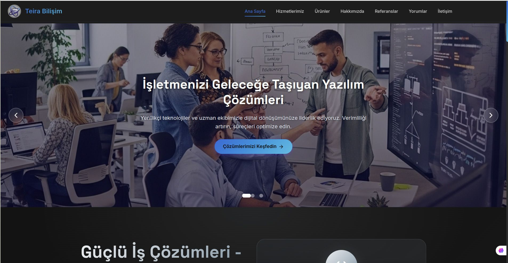
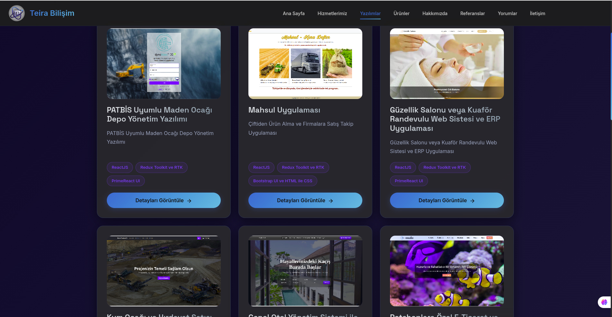

# 🌐 Teira Bilişim – Resmi Web Sitesi

Bu proje, **Teira Bilişim** firmasının resmi web sitesidir.  
Tasarımı, kodlaması ve tüm backend & frontend entegrasyonları **tamamen sıfırdan** tarafımca geliştirilmiştir.  
Modern arayüz, güçlü backend yapısı ve SEO uyumlu mimarisiyle profesyonel bir yazılım vitrini oluşturulmuştur.

🔗 **Canlı Site:** [https://teirabilisim.com](https://teirabilisim.com)

---

## 🧩 Teknolojiler ve Kullanılan Yapılar

### 🎨 Frontend
- ⚛️ **ReactJS** – Bileşen tabanlı modern arayüz yapısı  
- 🧠 **Redux Toolkit & RTK Query** – Global state yönetimi ve veri entegrasyonu  
- 💠 **PrimeReact** – Gelişmiş UI bileşenleri  
- 🖼️ **React Icons** – Minimal ve modern ikon setleri  
- 🧩 **Bootstrap 5, HTML & CSS** – Responsive tasarım ve sade grid sistemi  

### ⚙️ Backend
- 🚀 **Golang (Go) Fiber Framework** – Hızlı, güvenli ve hafif API yapısı  
- 🧰 **Güvenlik Katmanları** – Giriş kontrolü, token bazlı doğrulama, input sanitization  
- 🗄️ **MariaDB 11.x** – Güçlü, optimize edilmiş ilişkisel veritabanı  

---

## 🧠 Yazılım Mimarisi

Proje iki ana katmandan oluşur:
1. **Frontend (ReactJS)** → RTK Query aracılığıyla backend API’lerine bağlanır.  
2. **Backend (Go Fiber)** → RESTful endpoint’ler, stored procedure destekli MariaDB işlemleri ve güvenli oturum yönetimi sağlar.  

Tüm servisler **modüler** ve **microservice uyumlu** şekilde tasarlanmıştır.

---

## 🚀 Özellikler
- Kullanıcı dostu, SEO ve performans odaklı tasarım  
- API tabanlı modül yönetimi  
- Gerçek zamanlı veri akışı ve RTK Query optimizasyonu  
- Responsive (mobil, tablet ve masaüstü) tasarım  
- Güvenli backend erişimi ve giriş kontrolü  
- Çoklu modül yönetimi (Stok Takip, Üretim, Sayım, TXT Upload vb.)  

---

## 📂 Proje Yapısı (Özet)
📁 teirabilisim
┣ 📁 frontend
┃ ┣ 📂 src
┃ ┃ ┣ 📂 components
┃ ┃ ┣ 📂 pages
┃ ┃ ┣ 📂 slices
┃ ┃ ┗ 📂 services
┣ 📁 backend
┃ ┣ 📂 controllers
┃ ┣ 📂 models
┃ ┣ 📂 routes
┃ ┗ main.go
┣ mainpage.jpg
┣ yazilim.jpg
┗ README.md

---

## 💡 Geliştirici Notu
Bu proje, **ReactJS** ve **Go Fiber** teknolojilerinin bir arada kullanılabileceğini gösteren örnek bir tam-stack yapıdadır.  
Tüm kodlar modüler, ölçeklenebilir ve microservice altyapısına uygun biçimde geliştirilmiştir.

---

## 🧑‍💻 Geliştirici
**Zafer – Full Stack Developer**  
📧 [info@teirabilisim.com](mailto:info@teirabilisim.com)  
🌐 [https://teirabilisim.com](https://teirabilisim.com)  
💼 ReactJS • Go Fiber • MariaDB • RTK Query • Web Güvenliği  

---

> 💬 *“Kod sadece çalışan satırlar değil, tasarımıyla anlatan bir hikayedir.”*  
> — Teira Bilişim
